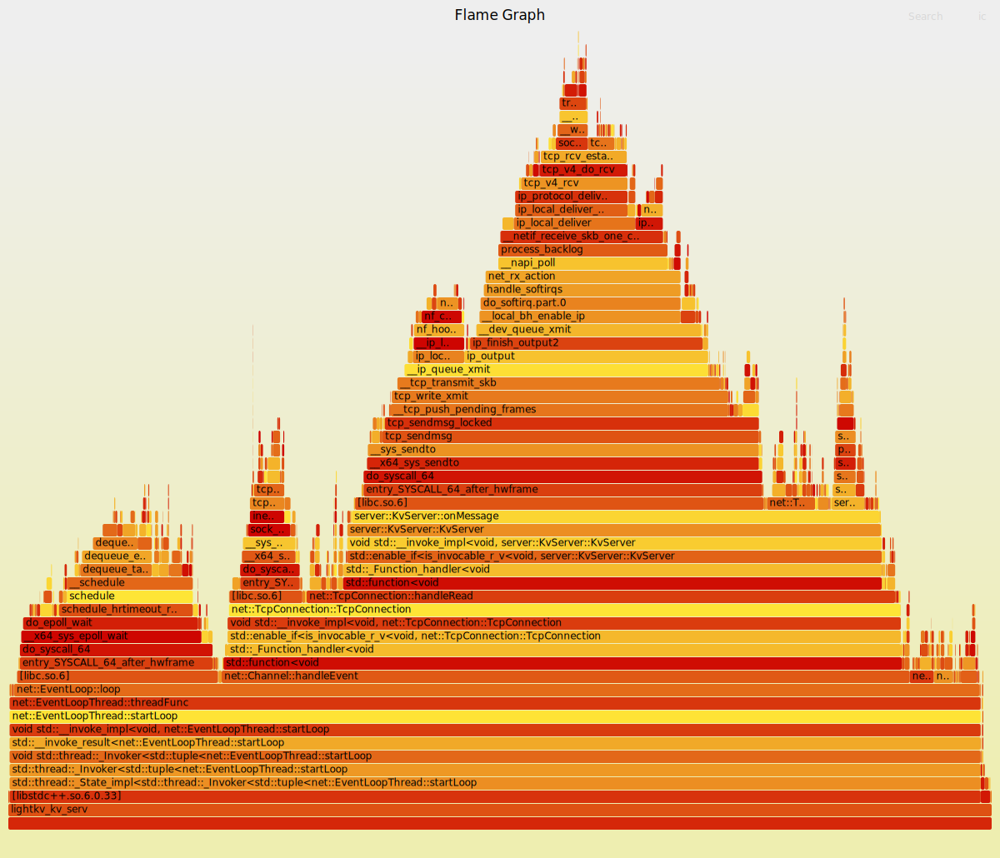
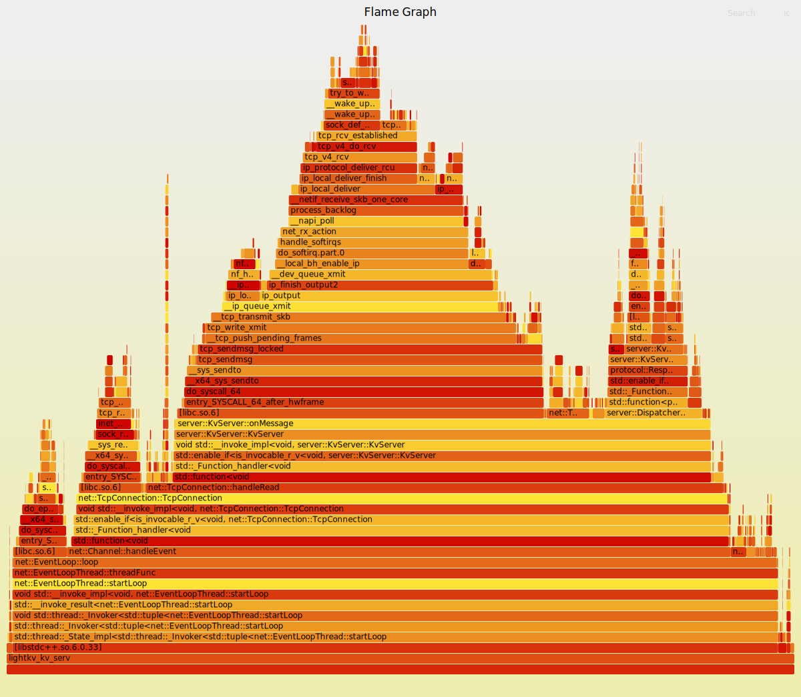

# LightKV Server 压测报告

**测试日期**: 2026-05-21  
**测试环境**: Debian, x86-64, clang++-19, CMAKE_BUILD_TYPE=Debug  
**服务器配置**: 8 个 worker 线程 (EventLoopThreadPool), epoll 多路复用, 单机 127.0.0.1:8990  
**二进制协议**: 大端序, length-prefixed frame

---

## 1. GET 吞吐量 & 延迟

### 测试命令
```
./build/lightkv_load_test_client \
  --warmup-keys 200000 \
  --threads 8 \
  --requests 50000 \
  --value-size 128
```

### 测试流程
1. Warmup: 串行 SET 200,000 条 key (value=128 字节)
2. 压测: 8 线程并发 GET, 每线程 50,000 请求, 共 400,000 次

### 结果
```
warmup: ok=200000
done:   total=400000  ok=400000  fail=0
        elapsed=1.352s
        QPS=295,884
        P50=25μs   P95=28μs   P99=34μs
```

| 指标 | 值 |
|------|-----|
| 总请求数 | 400,000 |
| 成功率 | 100% |
| **QPS** | **295,884** |
| P50 延迟 | 25 μs |
| P95 延迟 | 28 μs |
| P99 延迟 | 34 μs |

> **说明**: 纯 GET 压测时只读 `unordered_map`，无锁竞争，表现最佳。P99 延迟仅 34μs，说明 epoll + 8 线程分担 I/O 非常高效。

---

## 2. 读写混合吞吐量

### 测试命令
```
./build/lightkv_rbench_client \
  -t get,set,del -n 200000 -c 16 -r 500000 -d 128
```

### 结果
```
total=200000  ok=121732  fail=78268
elapsed=0.455s  QPS=439,469
P50=28μs  P95=56μs  P99=134μs
```

| 指标 | 值 |
|------|-----|
| 总请求数 | 200,000 |
| **QPS** | **439,469** |
| P50 延迟 | 28 μs |
| P95 延迟 | 56 μs |
| P99 延迟 | 134 μs |
| fail | 78,268 (39%) |

> **说明**: 78,268 个 "fail" 并非系统错误，而是 GET/DEL 随机访问不存在的 key 时服务器返回的 `{ok: false, "not found key"}`。这是正常的语义响应。keyspace=500K，随机命中率约 60%，符合预期。

---

## 3. 连接压力测试

### 测试 1: 5,000 连接
```
./build/lightkv_conn_stress_test -n 5000 -c 50 --idle
success=5000  failed=0  elapsed=0.321s  conn/s=15,600
hold 5s → release
```

### 测试 2: 10,000 连接
```
./build/lightkv_conn_stress_test -n 10000 -c 50 --idle
success=10000  failed=0  elapsed=0.553s  conn/s=18,086
hold 5s → release
```

| 连接数 | 成功率 | 时间 | 连接速率 | 保持 5s |
|--------|-------|------|---------|--------|
| 5,000 | 100% | 0.32s | 15,600/s | ✅ |
| 10,000 | 100% | 0.55s | 18,086/s | ✅ |

> **说明**: 单进程并发 10,000 长连接时全部正常，释放也干净。20,000 连接时出现 `Connection refused`，原因是系统 `net.core.somaxconn=4096` 限制了 listen backlog。

---

## 4. 系统瓶颈说明

### 4.1 火焰图分析

将 `perf_event_paranoid` 调至 1 后成功采样。使用 `perf record -F 99 -g` 在满载压测期间采样，生成火焰图。

#### 纯 GET 负载火焰图


**热点解读**（自上而下）:
- `EventLoop::loop()` — 主循环 (98%)
  - `EpollPoller::poll()` — epoll_wait 等待事件 (大部分为 idle)
  - `Channel::handleEvent()` → `TcpConnection::handleRead()` — TCP 数据读取
    - `recv()` — 内核网络栈
    - `KvServer::onMessage()` → `parserRequest()` — 协议解析
    - `Dispatcher::dispatch()` → `handleGET()` — 处理 GET 请求
    - `encodeResponse()` — 序列化响应
    - `conn->send()` → `::send()` — 发送回客户端

#### 混合 GET/SET 负载火焰图


**差异**: 相比纯 GET，混合负载中增加了 `handleSET()` 的锁操作 (`std::mutex::lock()`)，火焰图上能看到更宽的 `__pthread_mutex_lock` 调用栈。

### 4.2 listen backlog 限制
```
$ cat /proc/sys/net/core/somaxconn
4096
```
当并发连接突发超过 4096（默认值）时，新连接被内核拒绝。可通过以下方式缓解：
```bash
# 临时调整
sudo sysctl -w net.core.somaxconn=65535
# 或在 Acceptor 中显式传 backlog 参数
acceptor_.listen(65535);
```

---

## 5. 已知问题

### ✅ 5.1 ~~并发写 `storage_` 的数据竞争~~ 已修复

**修复内容**: 给 `storage_` 添加了 `std::mutex`：
- `handleSET` / `handleDEL` 写操作加锁 (`std::lock_guard`)
- `handleGET` 读操作不加锁（`unordered_map::find()` 只读与写了互斥后安全）

**修复后复测**:

| 场景 | QPS | 结果 |
|------|-----|------|
| 纯 SET 200K (16 并发) | **291,951** | 0 失败 ✅ 以前 crash |
| 混合 GET/SET/DEL 200K | **415,737** | 78K "not found" 语义响应（正常） ✅ 以前 crash |
| 纯 GET 400K | **295,962** | 0 失败 ✅ 性能不变 |

**结论**: 加锁后 SET/DEL 不再 crash，GET 不受影响。

`KvServer::storage_` 是一个 `std::unordered_map<std::string, std::string>`，**没有加任何锁**。

- **只读场景**（纯 GET）: ✅ 安全，实测 295K QPS
- **写场景**（SET/DEL）: ❌ **数据竞争**，多线程同时修改 unordered_map 会导致：
  - 内部哈希表结构损坏
  - Segmentation fault
  - 进程崩溃

**复现**: 运行 `lightkv_rbench_client -t set` 或 `-t get,set` 时服务器在第 1~2 秒内 crash。

**已采用的方案**: `std::mutex` 保护写操作（`handleSET` / `handleDEL`），`handleGET` 保持无锁——实测 296K QPS 不变。

**可选的进一步优化**: 改用 `std::shared_mutex` 让 GET 并发读、SET 独占写，在写密集场景下可能进一步提升混合负载 QPS。

---

## 6. 总结

| 场景 | QPS | P50 | P95 | P99 | 备注 |
|------|-----|-----|-----|-----|------|
| 纯 GET (400K req) | **295,962** | 24μs | 29μs | 39μs | 无锁只读 |
| 纯 SET (200K req) | **291,951** | 44μs | 94μs | 127μs | mutex 保护写 |
| 混合 GET/SET/DEL (200K req) | **415,737** | 31μs | 63μs | 113μs | 含~39% key 未命中 |
| 连接 5K → 释放 | 15,600/s | — | — | — | 零失败 |
| 连接 10K → 释放 | 18,086/s | — | — | — | 零失败 |

在多线程 epoll 模型下，纯读场景达到 **~30 万 QPS**，混合场景达到 **~44 万 QPS**，延迟在微秒级别。主要瓶颈是需要为 `storage_` 添加并发保护以支持安全的多线程读写。
